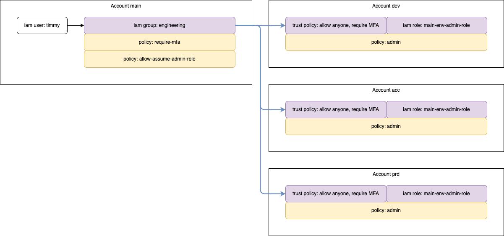

# Terraform AWS Multi-Account Structure

## Summary

If we just took our AWS Solutions Architect Associate certification and we landed our first job we're immediately exposed to more advanced topics in IAM.

One of these which might come as a shock is IAM in conjunction with IAM roles, cross account, Terraform and with Terraform Workspaces.

My hopes is that this guide will give you a softer landing so you understand how these topics are often used together.

## Prerequisites

Before proceesing keep in mind this guide touches on more advanced concepts although I try to keep it simplified.

I recommended that you're familiar with basic understanding of the following concepts:

- Familiarity with MFA virtual software such as 1Password or Google Authenticator
- If you login with your root account, enable MFA immediately; this should be the first thing you do!
- unix concepts like here-doc and environment variables
- terraform command line
- aws cli and authentication
- aws iam users, groups and roles

## Architecture



## Before Terraform

### AWS Main Account: Authentication Prerequisites

Create an IAM group (eg. engineering) with the policy AdministratorAccess attached.

Create an IAM user and place the it in the newly created group.

Enable MFA for the user and create access keys.

Install AWS CLI on your client.

Install awsume on your client.

Install Terraform on your client.

Configure authentication to AWS from your client.

Below is an example of how you can configure authentication towards AWS from your local client so its usable by awsume.

```bash
export ORGANISATION=abc
export ACCOUNT_ID_MAIN=000000000000
export IAM_USER=abc
export IAM_GROUP=abc
export ACCESS_KEY=abc
export SECRET_KEY=abc
```

```bash
cat <<EOF > ~/.aws/config
[profile user-aws-priv-$IAM_USER]
account_id_MAIN = $ACCOUNT_ID_MAIN
mfa_serial = arn:aws:iam::$ACCOUNT_ID_MAIN:mfa/$IAM_USER
EOF
```

```bash
cat <<EOF > ~/.aws/credentials
[user-aws-priv-$IAM_USER]
aws_access_key_id = $ACCESS_KEY
aws_secret_access_key = $SECRET_KEY
cli_pager =
EOF
```

Authentication to AWS with awsume.

```bash
❯ awsume user-aws-priv-IAM_USER
```

```bash
❯ aws sts get-caller-identity --output json
```

### AWS Main Account: Terraform Backend Resources

Create the Terraform backend related resouces manually, and in this case via the AWS CLI to speed up the process.

Later on these resources won't be injected into the Terraform state in order to prevent yourself from loosing connection to AWS.

Create the follwing resources.

Syntax: ENVIRONMENT-ORGANISATION-terraform-state-file
Syntax: ENVIRONMENT-ORGANISATION-terraform-state-lock

| Naming                                 | AWS Resource |
| -------------------------------------- | ------------ |
| main-ORGANISATION-terraform-state-file | S3           |
| main-ORGANISATION-terraform-state-lock | DynamoDB     |

```bash
export env=main

aws s3api create-bucket \
  --bucket $env-$ORGANISATION-terraform-state-file \
  --region eu-west-1 \
  --create-bucket-configuration LocationConstraint=eu-west-1 | cat

aws s3api put-bucket-tagging \
    --bucket $env-$ORGANISATION-terraform-state-file \
    --tagging "TagSet=[{Key=iac,Value=false},{Key=env,Value=$env}]" | cat

aws s3api put-bucket-encryption \
  --bucket $env-$ORGANISATION-terraform-state-file \
  --server-side-encryption-configuration '{"Rules": [{"ApplyServerSideEncryptionByDefault":{"SSEAlgorithm": "AES256"}}]}' | cat

aws dynamodb create-table \
  --table-name $env-$ORGANISATION-terraform-state-lock \
  --attribute-definitions AttributeName=LockID,AttributeType=S \
  --key-schema AttributeName=LockID,KeyType=HASH \
  --billing-mode PAY_PER_REQUEST \
  --region eu-west-1 \
  --tags Key=iac,Value=false Key=env,Value=$env Key=backend,Value=true | cat
```

### AWS Main Account: Terraform Configuration, Backend

The backend configuration is vital for the whole setup so we're going to avoid placing it into the same terraform state to minimise the risk of being locked out.

We will only reference the resource which were manually created earlier.

Create the terraform backend which will reference the resources previously created.

```bash
cat <<EOF > versions.tf
terraform {
  required_providers {
    aws = {
      source = "hashicorp/aws"
      version = "4.57.1"
    }
  }
}
EOF

cat <<EOF > providers.tf
provider "aws" {
  region = "eu-west-1"
}
EOF

cat <<EOF > backend.tf
terraform {
  backend "s3" {}
}
EOF
```

```bash
cat <<EOF > envs/main.tfbackend
region         = "eu-west-1"
bucket         = "main-$ORGANISATION-terraform-state-file"
key            = "main-$ORGANISATION-terraform.tfstate"
encrypt        = true
dynamodb_table = "main-$ORGANISATION-terraform-state-lock"
EOF

cat <<EOF > envs/main.tfvars
environment_full_Name = main
EOF
```

By now you should have the following file structure.

```bash
envs
├── main.tfbackend
└── main.tfvars
backend.tf
providers.tf
version.tf
```

### AWS Main Account: Terraform Configuration, Resources

Keep in mind the code I'm providing here is very simplified and is by now means made for a production environment. However it does give you a good standing ground in order to develop your skills further and ask tourself quesions on what you can do to improve your on LAB environment.

```bash
cat <<EOF > iam.tf
resource "aws_iam_group" "$IAM_GROUP" {
  name = "$IAM_GROUP"
}

resource "aws_iam_user" "$IAM_USER" {
  name = "$IAM_USER"

  tags = {
    iac = true
    env = "\${terraform.workspace}"
  }
}

resource "aws_iam_group_membership" "$IAM_GROUP" {
  name = "$IAM_GROUP"
  group = aws_iam_group.$IAM_GROUP.name

  users = [
    aws_iam_user.$IAM_USER.name
  ]
}
EOF
```

The Terraform init command will migrate you into S3 as one of the state backend resources.

```bash
terraform workspace new main
terraform workspace list
terraform init -backend-config=envs/main.tfbackend
```

You should now be able to see the the S3 bucket previously created if populated with the following structure from the AWS Console.

```bash
env:
└── main
    ├── main-ORGANISATION-terraform.tfstate
```

At this stage Terraform will want to create new resources however this is now what we want as they are already created manually.

We need to import them into the Terraform state file.

```bash
terraform import aws_iam_group.$IAM_GROUP $IAM_GROUP
terraform import aws_iam_user.$IAM_USER $IAM_USER
```

New we're ready to proceed with the Terraform plan phase, however note that we're going to send the output into a dedicated file.

This allows us to save the plan and when applying the changes that we link it to a specific source rather than relying on dynamic measured.

```bash
terraform plan -var-file=envs/main.tfvars -out=tfplan
```

The Terraform plan will reveal the user will be added tags and that a new group memmbership resource will be created; proceed with terraform apply.

```bash
terraform apply tfplan
```

### AWS Main Account: Terraform Configuration, IAM Role and MFA

```bash
aws iam create-policy --policy-name enforce-mfa --description 'Require MFA, and give no other permissions except creation of own MFA.' --policy-document "{
    \"Version\": \"2012-10-17\",
    \"Statement\": [
        {
            \"Sid\": \"AllowListActions\",
            \"Effect\": \"Allow\",
            \"Action\": [
                \"iam:ListUsers\",
                \"iam:ListVirtualMFADevices\"
            ],
            \"Resource\": \"*\"
        },
        {
            \"Sid\": \"AllowUserToCreateVirtualMFADevice\",
            \"Effect\": \"Allow\",
            \"Action\": [
                \"iam:CreateVirtualMFADevice\"
            ],
            \"Resource\": \"arn:aws:iam::*:mfa/*\"
        },
        {
            \"Sid\": \"AllowUserToManageTheirOwnMFA\",
            \"Effect\": \"Allow\",
            \"Action\": [
                \"iam:EnableMFADevice\",
                \"iam:ListMFADevices\",
                \"iam:ResyncMFADevice\"
            ],
            \"Resource\": \"arn:aws:iam::*:user/\${aws:username}\"
        },
        {
            \"Sid\": \"AllowUserToDeactivateTheirOwnMFAOnlyWhenUsingMFA\",
            \"Effect\": \"Allow\",
            \"Action\": [
                \"iam:DeactivateMFADevice\"
            ],
            \"Resource\": [
                \"arn:aws:iam::*:user/\${aws:username}\"
            ],
            \"Condition\": {
                \"Bool\": {
                    \"aws:MultiFactorAuthPresent\": \"true\"
                }
            }
        },
        {
            \"Sid\": \"BlockMostAccessUnlessSignedInWithMFA\",
            \"Effect\": \"Deny\",
            \"NotAction\": [
                \"iam:CreateVirtualMFADevice\",
                \"iam:EnableMFADevice\",
                \"iam:ListMFADevices\",
                \"iam:ListUsers\",
                \"iam:ListVirtualMFADevices\",
                \"iam:ResyncMFADevice\"
            ],
            \"Resource\": \"*\",
            \"Condition\": {
                \"BoolIfExists\": {
                    \"aws:MultiFactorAuthPresent\": \"false\"
                }
            }
        }
    ]
}"
```

More information on the IAM policy with its statements can be found [here](https://docs.aws.amazon.com/IAM/latest/UserGuide/reference_policies_examples_iam_mfa-selfmanage.html).

```bash
aws iam attach-group-policy --group-name engineering --policy-arn arn:aws:iam::720202285756:policy/enfource-mfa
```

Once this policy is attached, AdministratorAccess will only function if any of the users assigned to the engineering group have MFA.

Finally create a policy and attach it to the group which would allow the main account to access the remote accounts via IAM roles.

```bash
export ACCOUNT_ID_DEV=564785638543
export ACCOUNT_ID_ACC=347598345943
export ACCOUNT_ID_PRD=345692542999

aws iam create-policy --policy-name assume-cross-account-admin-roles --policy-document "{
    \"Version\": \"2012-10-17\",
    \"Statement\": [
        {
            \"Effect\": \"Allow\",
            \"Action\": \"sts:AssumeRole\",
            \"Resource\": [
              \"arn:aws:iam::${ACCOUNT_ID_DEV}:role/main-admin-dev-fullaccess\",
              \"arn:aws:iam::${ACCOUNT_ID_ACC}:role/main-admin-acc-fullaccess\",
               \"arn:aws:iam::${ACCOUNT_ID_PRD}:role/main-admin-prd-fullaccess\"
            ]
        }
    ]
}" | cat

aws iam attach-group-policy --group-name engineering --policy-arn arn:aws:iam::720202285756:policy/assume-cross-account-admin-roles | cat
```

Append the following to the iam.tf so we keep the changes in code and finally import the remote changes into the Terraform state.

```bash
cat <<EOF > iam.tf
resource "aws_iam_group" "$IAM_GROUP" {
  name = "$IAM_GROUP"
}

resource "aws_iam_user" "$IAM_USER" {
  name = "$IAM_USER"

  tags = {
    iac = true
    env = "\${terraform.workspace}"
  }
}

resource "aws_iam_group_membership" "$IAM_GROUP" {
  name = "$IAM_GROUP"
  group = aws_iam_group.$IAM_GROUP.name

  users = [
    aws_iam_user.$IAM_USER.name
  ]
}

resource "aws_iam_policy" "enforce_mfa" {
  name        = "enforce-mfa"
  description = "Require MFA, and give no other permissions except creation of own MFA."

  policy = jsonencode({
    "Version" : "2012-10-17", #tfsec:ignore:aws-iam-no-policy-wildcards
    "Statement" : [
      {
        "Sid" : "AllowListActions",
        "Effect" : "Allow",
        "Action" : [
          "iam:ListUsers",
          "iam:ListVirtualMFADevices"
        ],
        "Resource" : "*"
      },
      {
        "Sid" : "AllowUserToCreateVirtualMFADevice",
        "Effect" : "Allow",
        "Action" : [
          "iam:CreateVirtualMFADevice"
        ],
        "Resource" : "arn:aws:iam::*:mfa/*"
      },
      {
        "Sid" : "AllowUserToManageTheirOwnMFA",
        "Effect" : "Allow",
        "Action" : [
          "iam:EnableMFADevice",
          "iam:ListMFADevices",
          "iam:ResyncMFADevice"
        ],
        "Resource" : "arn:aws:iam::*:user/$${aws:username}"
      },
      {
        "Sid" : "AllowUserToDeactivateTheirOwnMFAOnlyWhenUsingMFA",
        "Effect" : "Allow",
        "Action" : [
          "iam:DeactivateMFADevice"
        ],
        "Resource" : [
          "arn:aws:iam::*:user/$${aws:username}"
        ],
        "Condition" : {
          "Bool" : {
            "aws:MultiFactorAuthPresent" : "true"
          }
        }
      },
      {
        "Sid" : "BlockMostAccessUnlessSignedInWithMFA",
        "Effect" : "Deny",
        "NotAction" : [
          "iam:CreateVirtualMFADevice",
          "iam:EnableMFADevice",
          "iam:ListMFADevices",
          "iam:ListUsers",
          "iam:ListVirtualMFADevices",
          "iam:ResyncMFADevice"
        ],
        "Resource" : "*",
        "Condition" : {
          "BoolIfExists" : {
            "aws:MultiFactorAuthPresent" : "false"
          }
        }
      }
    ]
  })
}

resource "aws_iam_group_policy_attachment" "enforce_mfa" {
  group      = aws_iam_group.engineering.name
  policy_arn = aws_iam_policy.enforce_mfa.arn
}
EOF
```

```bash
terraform import -var-file=envs/main.tfvars aws_iam_policy.enforce_mfa arn:aws:iam::720202285756:policy/enforce-mfa
terraform import -var-file=envs/main.tfvars aws_iam_group_policy_attachment.enforce_mfa engineering/arn:aws:iam::720202285756:policy/enfource-mfa
```

### AWS Environments Accounts: Creating 3x accounts

In your AWS main account, open AWS Organizations and click on Add an AWS account.

The trick here is to reuse your main email address in order to not have to create multiple e-mail accounts and deal with more administration.

By adding an increment before the @ symbol you can reuse the same email again.

| AWS Account Name | Email                 |
| ---------------- | --------------------- |
| dev              | my.email+1@domain.com |
| acc              | my.email+2@domain.com |
| prd              | my.email+3@domain.com |

Finally take notes of your new AWS account IDs as they will be used later.

### AWS Environments Accounts: Terraform Backend Resources

Note! You'll need to repeat this whole process for all your environment accounts.

| Naming                                | AWS Resource |
| ------------------------------------- | ------------ |
| dev-ORGANISATION-terraform-state-file | S3           |
| dev-ORGANISATION-terraform-state-lock | DynamoDB     |
| main-admin-dev-fullaccess             | IAM Role     |
| acc-ORGANISATION-terraform-state-file | S3           |
| acc-ORGANISATION-terraform-state-lock | DynamoDB     |
| main-admin-acc-fullaccess             | IAM Role     |
| prd-ORGANISATION-terraform-state-file | S3           |
| prd-ORGANISATION-terraform-state-lock | DynamoDB     |
| main-admin-prd-fullaccess             | IAM Role     |

Login with the root accounts, and create administrator accounts on each and ofc with MFA enabled.

```bash
export env=dev

aws s3api create-bucket \
  --bucket $env-$ORGANISATION-terraform-state-file \
  --region eu-west-1 \
  --create-bucket-configuration LocationConstraint=eu-west-1 | cat

aws s3api put-bucket-tagging \
    --bucket $env-$ORGANISATION-terraform-state-file \
    --tagging "TagSet=[{Key=iac,Value=false},{Key=env,Value=$env}]" | cat

aws s3api put-bucket-encryption \
  --bucket $env-$ORGANISATION-terraform-state-file \
  --server-side-encryption-configuration '{"Rules": [{"ApplyServerSideEncryptionByDefault":{"SSEAlgorithm": "AES256"}}]}' | cat

aws dynamodb create-table \
  --table-name $env-$ORGANISATION-terraform-state-lock \
  --attribute-definitions AttributeName=LockID,AttributeType=S \
  --key-schema AttributeName=LockID,KeyType=HASH \
  --billing-mode PAY_PER_REQUEST \
  --region eu-west-1 \
  --tags Key=iac,Value=false Key=env,Value=$env Key=backend,Value=true | cat
```

Create the IAM role with the Assume Role Policy seen in the sommand.

```bash
aws iam create-role \
    --role-name main-admin-$env-fullaccess \
    --assume-role-policy-document "{
        \"Version\": \"2012-10-17\",
        \"Statement\": [
            {
                \"Sid\": \"AllowMainAccount\",
                \"Effect\": \"Allow\",
                \"Principal\": {
                    \"AWS\": \"arn:aws:iam::720202285756:root\"
                },
                \"Action\": \"sts:AssumeRole\",
                \"Condition\": {
                    \"Bool\": {
                        \"aws:MultiFactorAuthPresent\": \"true\"
                    }
                }
            }
        ]
    }"

aws iam tag-role \
  --role-name my-role \
  --tags Key=iac,Value=true Key=env,Value=$env

aws iam attach-role-policy \
  --role-name main-admin-$env-fullaccess \
  --policy-arn arn:aws:iam::aws:policy/AdministratorAccess
```

Check if you can assume your roles via awsume.

Here's an examole of the ~/.aws/config to get you started.

```bash
cat <<EOF >> ~/.aws/config

[profile role-dev-admin]
source_profile = user-main-admin-$IAM_USER
role_arn = arn:aws:iam::$ACCOUNT_ID_DEV:role/main-admin-dev-fullaccess

[profile role-acc-admin]
source_profile = user-main-admin-$IAM_USER
role_arn = arn:aws:iam::$ACCOUNT_ID_ACC:role/main-admin-acc-fullaccess

[profile role-prd-admin]
source_profile = user-main-admin-$IAM_USER
role_arn = arn:aws:iam::$ACCOUNT_ID_PRD:role/main-admin-prd-fullaccess
EOF
```

Now you should be able to use awsume to login to the other accounts through the roles you've created.

```bash
❯ awsume -l
Listing...

==================================AWS Profiles==================================
PROFILE                 TYPE  SOURCE                  MFA?  REGION  ACCOUNT
role-acc-admin          Role  user-main-admin-USER    No    None    000000000000
role-dev-admin          Role  user-main-admin-USER    No    None    000000000000
role-prd-admin          Role  user-main-admin-USER    No    None    000000000000
user-main-admin-USER    User  None                    Yes   None    000000000000
```

Try out all the roles and verify that you've accessing the right AWS account.

```bash
❯ awsume role-acc-admin
Session token will expire at 0000-00-00 00:00:00
[role-acc-admin] Role credentials will expire 0000-00-00 00:00:00
```

```bash
❯ aws sts get-caller-identity --output json
{
    "UserId": "AAAAAAAAAAAAAAAAAAAA:role-acc-admin",
    "Account": "000000000000",
    "Arn": "arn:aws:sts::000000000000:assumed-role/main-admin-acc-fullaccess/role-acc-admin"
}
```

If you've made it this far then go out for a walk and get some rest!

### AWS Environments Accounts: Terraform Configuration & State

Now it's time we bring the resources into the Terraform state, and here's where we'll be using workspaces more properly.

For this however I recommend you create a separate git repository in order to better simulate the feeling or releasing applications later in your studies.

```bash
cat <<EOF > versions.tf
terraform {
  required_providers {
    aws = {
      source = "hashicorp/aws"
      version = "4.57.1"
    }
  }
}
EOF

cat <<EOF > providers.tf
provider "aws" {
  region = "eu-west-1"

  assume_role {
    role_arn = var.iam_role_arn
  }
}
EOF

cat <<EOF > backend.tf
terraform {
  backend "s3" {}
}
EOF

cat <<EOF > variables.tf
variable "iam_role_arn" {
  description = "IAM role used when deploying resources in the TF workspace."
  type        = string
  default     = ""
}
EOF
```

Create separate .tfbackend and .tfvars files for each AWS account except the main.

```bash
export env=dev
export environment_full_Name=development
export account_id=000000000000

cat <<EOF > envs/$env.tfbackend
region         = "eu-west-1"
bucket         = "$env-$ORGANISATION-terraform-state-file"
key            = "$env-$ORGANISATION-terraform.tfstate"
encrypt        = true
dynamodb_table = "$env-$ORGANISATION-terraform-state-lock"
role_arn       = "arn:aws:iam::$ACCOUNT_ID:role/main-admin-$env-fullaccess"
EOF

cat <<EOF > envs/$env.tfvars
environment_full_Name = $environment_full_Name
EOF
```

By now you should have the following file structure.

```bash
envs
├── dev.tfbackend
├── dev.tfvars
├── acc.tfbackend
├── acc.tfbackend
├── prd.tfbackend
└── prd.tfvars
backend.tf
providers.tf
version.tf
```

By now its time to start setting up the statefile and statelock for each new environment and with the proper use of Terraform workspaces.

Repeat the following for each AWS account and verify your S3 bucket in each that the tfvars files are created.

```bash
export env=dev

# Initialises and downloads the Terraform plugins
terraform init -backend-config=envs/$(env).tfbackend -reconfigure

# Select the apropiate Terraform workspace and if missing create it
terraform workspace select $(env) || terraform workspace new $(env)
```

Now its time we add the IAM role resource in each AWS account except main into Terraform and then import it into the state so its not created.

````bash
cat <<EOF >> iam.tf
resource "aws_iam_role" "main_admin_fullaccess" {
  name = "main-admin-\${terraform.workspace}-fullaccess"

  assume_role_policy = jsonencode({
    Version = "2012-10-17"
    Statement = [
      {
        Sid    = "AllowMainAccount"
        Effect = "Allow"
        Principal = {
          AWS = "arn:aws:iam::720202285756:root"
        }
        Action = "sts:AssumeRole",
        Condition : {
          "Bool" : {
            "aws:MultiFactorAuthPresent" : "true"
          }
        }
      }
    ]
  })

  managed_policy_arns = ["arn:aws:iam::aws:policy/AdministratorAccess"]

  tags = {
    iac = true
    env = "\${terraform.workspace}"
  }
}
EOF

```bash
terraform import -var-file=envs/$env.tfvars aws_iam_role.main_admin_fullaccess main-admin-$env-fullaccess
````

Once you issue a Terraform plan there should be no significant changes proposed.

```bash
terraform plan -var-file=envs/$(env).tfvars -out=tfplan
```

```bash
terraform apply tfplan
```

Cheers! At this stage you should have a dynamic repo working on Terraform workspaces and backends on different AWS accounts.

### Makefiles, Main Repository

By now you've noticed theres a lot of commands typed for Terraform and surely there must be an easier way to do this? Enter Makefiles!

This method that I use requires Docker since all the executions are done from inside an encapsulated environment, however you need to authenticate to AWS from outside.

The AWS credentials will be passed into the container as ENV VARs.

Have a look at the makefiles in the repo and copy each over to the root of the apropiate git repo you've created under the filename of Makefile.

```bash
# Initialise Terraform
make init ENV=main

# Terraform plan
make plan

# Terraform apply
make apply
```

### Makefiles, Environments Repository

```bash
cat <<EOF >> Makefile

EOF
```

```bash
# Initialise Terraform
make init ENV=dev

# Terraform plan
make plan

# Terraform apply
make apply
```
